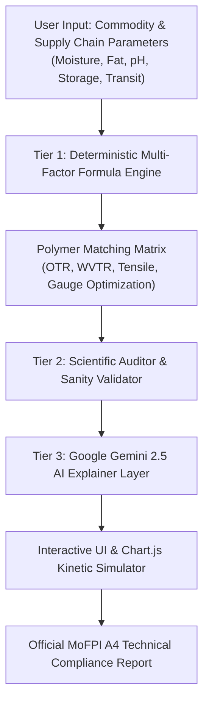
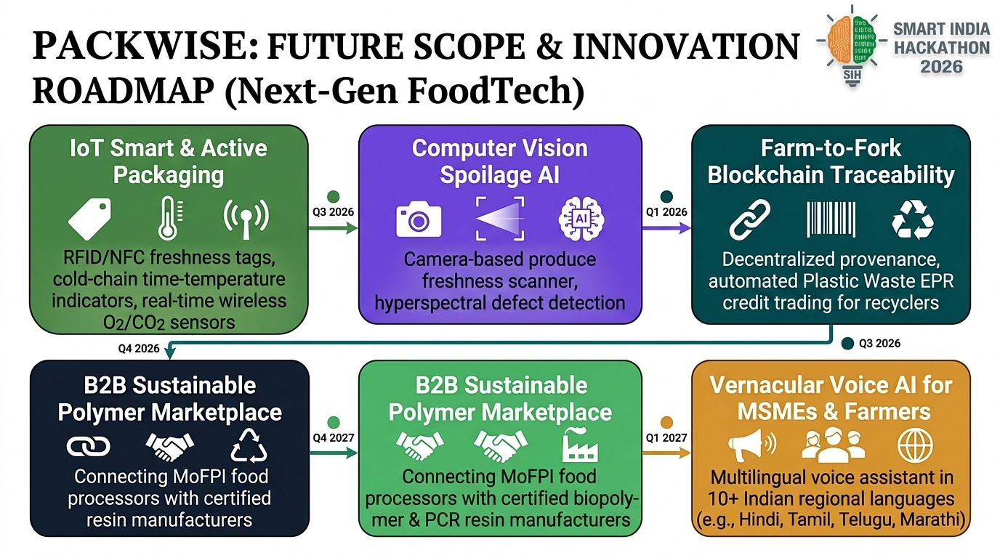

# 📦 PackWise - Scientific Food Packaging Decision-Support Dashboard

[](https://fastapi.tiangolo.com)
[](https://www.python.org/)
[](https://ai.google.dev/)
[](https://render.com)
[](https://opensource.org/licenses/MIT)

**PackWise** is an advanced, AI-assisted scientific food packaging recommendation and decision-support engine developed for the **Ministry of Food Processing Industries (MoFPI)** under **Smart India Hackathon (SIH 26236)**. 

It bridges agricultural science, polymer chemistry, and computational food technology to recommend optimized, sustainable, and cost-effective packaging solutions for perishables, processed items, dairy, and meat products.

---

## 🌟 Key Highlights

- **Bilingual Interface:** Instant 1-click toggle between **English** and **Hindi (हिंदी)** across all forms, simulators, and technical report spec sheets.
- **3-Tier Scientific Architecture:** 
  1. *Tier 1: Deterministic Formula Engine* (Numerical calculations for OTR, WVTR, shelf-life, and multi-factor polymer scores).
  2. *Tier 2: Scientific Auditor* (Validates shelf-life integrity and permeability thresholds).
  3. *Tier 3: Gemini 2.5 AI Explainer* (Technical insights, trade-offs, and regulatory advisory).
- **128+ Certified Materials Database:** High-barrier films, biodegradable polymers (PLA/PBAT), laser-perforated produce wraps (EMAP), and retort triplex laminates.
- **Interactive Shelf-Life Simulator:** Visual kinetic degradation curves comparing unpackaged baseline vs generic polyethylene vs PackWise optimized packaging.
- **Circular Sustainability & LCA Index:** Quantitative eco-scoring aligned with India's **Plastic Waste Management Rules (PWMR 2022)** and Extended Producer Responsibility (EPR) mandates.
- **Official A4 Technical Report:** Print-ready export format with dynamic real-time timestamping for industrial and regulatory compliance submissions.

---

## 🏛️ System Architecture



---

## 🛠️ Tech Stack

- **Backend:** [FastAPI](https://fastapi.tiangolo.com/), [Uvicorn](https://www.uvicorn.org/), Python 3.11
- **AI / LLM Integration:** Google GenAI SDK (`google-genai`), Gemini 2.5 Flash
- **Frontend:** Semantic HTML5, Custom Agri-FoodTech CSS Design System, [Chart.js 4.4](https://www.chartjs.org/)
- **Deployment:** Render Cloud, Docker/Procfile Ready, GitHub Actions

---

## 🚀 Quick Start (Local Setup)

### 1. Prerequisites
- Python 3.10+ installed
- Git installed

### 2. Clone the Repository
```bash
git clone https://github.com/your-username/sih236foodpakaging.git
cd sih236foodpakaging
```

### 3. Install Dependencies
```bash
pip install -r requirements.txt
```

### 4. (Optional) Set up Google Gemini API Key
Create a `.env` file in the root directory:
```env
GEMINI_API_KEY=your_gemini_api_key_here
```
*(If no API key is provided, PackWise runs seamlessly with its deterministic local scientific auditor)*.

### 5. Run the Server
```bash
python server.py
```
Open your browser and visit: **`http://localhost:8080`**

---

## ☁️ Deploy to Render (Cloud)

1. Fork or push this repository to your **GitHub** account.
2. Sign in to [Render.com](https://render.com) using GitHub.
3. Click **"New +"** &rarr; **"Web Service"**.
4. Connect this repository and set the following parameters:
   - **Language:** `Python 3`
   - **Build Command:** `pip install -r requirements.txt`
   - **Start Command:** `python server.py`
   - **Plan:** Free
5. *(Optional)* Add Environment Variable:
   - **Key:** `GEMINI_API_KEY`
   - **Value:** `<your-api-key>`
6. Click **"Deploy Web Service"**. Render will build and host your app live!

---

## 📋 Regulatory & Standards Compliance

PackWise aligns with Indian and global food packaging benchmarks:
- **FSSAI Food Safety and Standards (Packaging) Regulations, 2018**
- **Bureau of Indian Standards (BIS):**
  - `IS 9845`: Overall Migration Testing
  - `IS 10146`: Polyethylene in contact with foodstuff
  - `IS 10141`: Polypropylene for food packaging
- **Ministry of Environment, Forest and Climate Change (MoEFCC):**
  - Plastic Waste Management Rules (PWMR 2022)
  - Extended Producer Responsibility (EPR) Guidelines

---

## 📂 Project Structure

```
d:/sih236foodpakaging/
├── index.html            # Main bilingual single-page application dashboard
├── server.py             # FastAPI backend with multi-factor engine & Gemini layer
├── requirements.txt      # Python package dependencies for local & cloud
├── render.yaml           # Render Cloud blueprint deployment file
├── README.md             # Project documentation
├── css/
│   └── style.css         # Responsive styling, modern color tokens & print styles
├── js/
│   └── app.js            # Bilingual controller, dynamic chart & report logic
└── app.js                # Core synchronized logic controller
```

---

## 🔮 Future Scope & Innovation Roadmap



1. **IoT Smart & Active Packaging:** RFID/NFC freshness tags, cold-chain time-temperature indicators (TTI), and wireless in-package O₂/CO₂ sensors.
2. **Computer Vision Spoilage AI:** Smartphone camera-based fresh produce quality scoring and hyperspectral defect inspection before packing.
3. **Farm-to-Fork Blockchain Traceability:** Decentralized supply-chain provenance and automated Plastic Waste Management EPR credit verification for recyclers.
4. **B2B Sustainable Polymer Marketplace:** Direct digital bridge connecting MoFPI food processors with certified biopolymer and PCR resin manufacturers.
5. **Vernacular Voice AI for MSMEs & Farmers:** Multilingual offline-first voice assistant in 10+ Indian regional languages (Hindi, Marathi, Tamil, Telugu, etc.).

---

## 📄 License

This project is licensed under the MIT License - see the [LICENSE](LICENSE) file for details.

---

**Developed with ❤️ for FoodTech & Sustainable Packaging Innovation · MoFPI**

